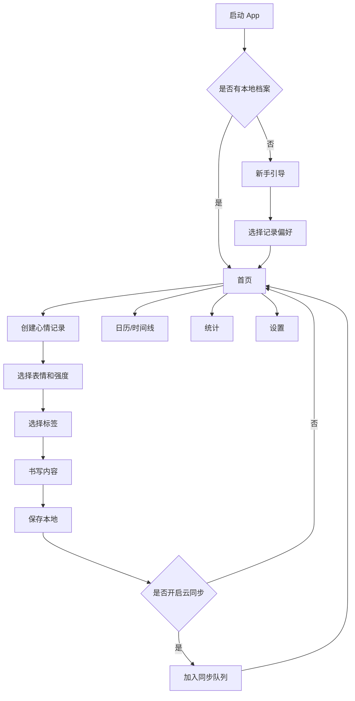

# 心情 App PRD

版本：v0.1  
日期：2026-05-31  
目标平台：iOS、Android  
文档状态：产品与技术方案初稿

## 0. 当前执行决策

当前项目先做“本地单机 Android MVP”。

- 第一阶段只支持单台手机本地记录。
- 第一阶段优先打 Android APK，并在华为 Pura/P70 Pro+ 真机测试。
- 第一阶段不做服务器、登录、云同步和两台手机互通。
- 数据默认保存在手机本地，必须提供导出能力。
- 代码架构要预留后续 iOS、服务器同步和双人互动扩展。

## 1. 产品概述

本产品是一款面向个人及亲密关系场景的心情记录 App。核心能力是让用户用小表情、情绪强度、标签和文字快速记录当下心情，并通过日历、趋势图、标签关联和回顾功能理解自己的情绪变化。

产品参考同类心情记录和情侣互动应用的常见模式，但定位上建议先做“个人心情记录体验”，再扩展“情侣/好友共享心情、每日问答、共同回忆、养成空间”等互动能力。这样可以让 MVP 更轻，数据和隐私模型更清晰，也方便后续商业化。

## 2. 竞品观察

### 2.1 Suki 类应用启发

Suki 的公开商店信息显示，它更偏情侣双人互动，包含匹配关系、共同空间、宠物养成、每日问答、心情日记、每日动态、小游戏和双人相册等模块。可借鉴的不是具体表现，而是“记录 + 互动 + 轻养成”的组合：

- 用心情记录作为每日入口。
- 用每日问答、评论、相册增强关系黏性。
- 用宠物、空间、任务等轻游戏化提高回访。
- 用共享心情让用户关心对方状态。

### 2.2 Mood Journal 类应用启发

Daylio、Reflect、Dawnli 等心情记录类产品通常强调：

- 快速选择心情和活动标签。
- 可写可不写的轻量日记。
- 周、月、年维度统计。
- 日历视图、Year in Pixels、连续记录。
- 提醒、主题、暗色模式、PIN/生物识别锁。
- 本地隐私、云备份、导出 CSV/PDF。

### 2.3 差异化方向

本产品建议采用以下差异化：

- 单人可完整使用，不依赖情侣关系。
- 情侣/好友互动作为可选模式，不打扰隐私用户。
- 情绪记录兼顾“快”和“深”：3 秒记录，3 分钟书写。
- 统计不只展示图表，还给出“可能影响心情的标签和事件”。
- 本地优先，默认私密，用户可选择云同步或共享。
- 预留 AI 情绪总结、写作提示、温和陪伴，但避免医疗诊断承诺。

## 3. 产品目标

### 3.1 业务目标

- 上线 iOS 和 Android 双端。
- 支持用户稳定记录心情、文字、标签和图片。
- 形成日历、趋势、回顾和设置等完整 App 闭环。
- 保留可扩展架构，后续加入双人互动、宠物养成、AI 分析、会员订阅。

### 3.2 用户目标

- 快速记下今天或此刻的心情。
- 能用文字、图片、标签补充发生了什么。
- 能回看过去的心情轨迹。
- 能看懂哪些事情可能让自己开心、焦虑、低落或平静。
- 能安全保存私密内容，并在换手机时恢复。
- 可选择与伴侣或好友共享部分心情。

### 3.3 产品原则

- 记录成本低：打开 App 后 1 次点击进入记录。
- 隐私优先：默认私密，分享必须显式选择。
- 情绪中立：不评判用户状态，不把低落视为失败。
- 数据可带走：支持导出和删除。
- 可渐进扩展：MVP 不强依赖宠物、AI 或社交。

## 4. 目标用户

### 4.1 核心用户

| 用户类型 | 特征 | 主要需求 |
| --- | --- | --- |
| 情绪自我观察者 | 想了解自己的情绪规律 | 快速记录、统计、趋势和回顾 |
| 日记轻量用户 | 不想每天写长文 | 小表情、标签、短句即可完成记录 |
| 亲密关系用户 | 希望和伴侣互相关心 | 心情共享、每日问答、评论、共同相册 |
| 压力管理用户 | 工作或学习压力较大 | 提醒、情绪触发因素、复盘和安抚提示 |
| 习惯养成用户 | 喜欢连续打卡和成就 | 连续记录、任务、成就、主题装扮 |

### 4.2 非目标用户

- 需要专业心理诊疗的人群。本产品可提供记录和自我观察，不提供医疗诊断。
- 只想公开社交发帖的人群。MVP 不做公共社区。
- 只需要纯文本长篇写作的人群。产品重点是心情结构化记录。

## 5. 产品范围

### 5.1 MVP 必做

- 账户系统：游客模式、本地数据、可选登录。
- 心情记录：表情、心情等级、文字、标签、图片。
- 记录管理：编辑、删除、按日期查看。
- 首页：今日心情入口、最近记录、连续记录天数。
- 日历：月视图、每日心情色块、小表情标记。
- 统计：心情趋势、分布、标签关联、记录频率。
- 提醒：每日提醒、本地通知。
- 设置：主题、暗色模式、隐私锁、数据导出、备份同步开关。
- 基础云同步：登录后跨设备同步文字记录和图片。

### 5.2 MVP 不做

- 公共动态广场。
- 即时聊天。
- 复杂宠物养成系统。
- 大型小游戏。
- 医疗诊断、风险评估和治疗建议。
- 多人群组空间。

### 5.3 第二阶段

- 双人绑定：情侣、好友或家人。
- 共享心情：选择性同步给对方。
- 每日问答：双方回答后互相可见。
- 轻互动：评论、抱抱、贴纸回应。
- 共同相册：按日期沉淀回忆。
- 空间装扮和轻养成：每日记录获得能量，用于装扮。

### 5.4 第三阶段

- AI 写作提示和情绪总结。
- 周报、月报、年度回顾。
- 自定义心情表情包。
- Widget、小组件、快捷记录。
- Apple Health / Google Fit 睡眠和步数关联。
- 会员订阅、主题商店、更多统计能力。

## 6. 核心功能需求

### 6.1 首页

首页是记录入口和状态概览，不做复杂信息流。

功能：

- 今日心情卡片：显示今天是否已记录、最近一次心情。
- 快速记录按钮：点击后进入心情选择。
- 最近记录：展示最近 3 条心情日记。
- 连续记录：展示连续天数和本月记录次数。
- 今日提示：一条可关闭的写作提示或每日问答入口。

验收标准：

- 新用户首次打开能在 10 秒内完成第一条心情记录。
- 已有记录用户能从首页进入编辑最近记录。
- 首页不暴露私密正文，默认只展示心情摘要。

### 6.2 心情记录

用户可以用结构化信息和自由文本记录一次心情。

字段：

- 心情表情：默认 5 到 7 个等级，如开心、平静、疲惫、焦虑、难过、生气。
- 心情强度：1 到 5 或 1 到 10。
- 文字内容：支持纯文本，后续支持 Markdown 或富文本。
- 标签：活动、人物、地点、事件、身体状态等。
- 图片：MVP 支持最多 3 张。
- 时间：默认当前时间，可补记。
- 可见性：私密、共享给绑定对象。
- 天气、位置：默认关闭，用户授权后记录。

交互：

- 第一步选小表情。
- 第二步选标签和强度。
- 第三步写内容，可跳过。
- 保存后返回首页或进入详情。

验收标准：

- 用户可以只选表情保存。
- 用户可以为同一天记录多次心情。
- 补记时可以选择过去日期和时间。
- 离线状态下可以保存，联网后自动同步。

### 6.3 记录详情

详情页用于查看和管理单条心情记录。

功能：

- 展示心情、强度、正文、标签、图片、时间。
- 编辑、删除、复制文字。
- 共享状态管理。
- 若开启双人模式，可查看对方回应。

验收标准：

- 删除前二次确认。
- 编辑后保留更新时间。
- 已同步数据删除后应同步到云端。

### 6.4 日历与时间线

日历和时间线用于回看。

功能：

- 月历：每天显示主心情色块或小表情。
- 时间线：按日期倒序展示记录。
- 筛选：心情、标签、是否有图片、是否共享。
- 搜索：按正文关键词和标签搜索。

验收标准：

- 月历切换流畅。
- 同一天多条记录时显示主心情，也可展开列表。
- 搜索结果可直接进入详情。

### 6.5 统计

统计模块帮助用户理解情绪规律。

MVP 图表：

- 心情趋势折线图：7 天、30 天、90 天。
- 心情分布饼图或柱状图。
- 标签关联：哪些标签出现时平均心情更高或更低。
- 记录热力图：按日期显示记录频次。
- 连续记录与漏记情况。

进阶图表：

- 一天内不同时间段心情差异。
- 工作日与周末对比。
- 睡眠、运动、天气与心情关联。
- 月度关键词云。

验收标准：

- 少于 3 条数据时展示空状态和引导，不给出误导性结论。
- 统计说明使用“可能相关”，不使用“导致”。
- 图表数据来自本地数据库，离线可查看。

### 6.6 提醒

提醒用于帮助用户形成记录习惯。

功能：

- 每日固定时间提醒。
- 可设置多个提醒。
- 可选择提醒文案风格。
- 支持跳过今天。
- 双人模式下可提醒“看看对方今天的心情”。

验收标准：

- 用户未授权通知时提供清晰引导。
- 本地提醒不依赖服务器。
- 用户可一键关闭所有提醒。

### 6.7 设置

功能：

- 账号：登录、退出、注销。
- 隐私：PIN 锁、生物识别锁、截图保护开关。
- 数据：云同步、备份、导出 CSV/PDF、导入。
- 外观：主题、暗色模式、字体大小。
- 通知：提醒时间和推送开关。
- 情绪配置：自定义心情名称、颜色、表情。
- 标签管理：新增、编辑、合并、删除标签。
- 关于：版本、用户协议、隐私政策、反馈入口。

验收标准：

- 注销账号前明确告知影响。
- 导出文件包含记录、标签和时间，图片单独打包或生成 PDF。
- 用户关闭云同步后，新增记录仅保存在本地。

## 7. 双人互动扩展需求

双人模式不是 MVP 的前置条件，但数据结构需要提前预留。

### 7.1 关系绑定

- 用户通过邀请码、二维码或链接绑定。
- 关系类型：情侣、好友、家人。
- 每个用户 MVP 后续阶段只允许绑定 1 个主要关系。
- 任一方可解除绑定。

### 7.2 心情共享

- 每条记录默认私密。
- 用户保存时可选择“同步给对方”。
- 对方只能看到被共享的字段。
- 支持评论、贴纸回应、抱抱等轻互动。

### 7.3 每日问答

- 每天生成 1 个问题。
- 双方提交后互相可见。
- 支持收藏和回顾。
- 问题库支持运营后台配置。

### 7.4 共同回忆

- 共享心情、问答、照片可沉淀到共同日历。
- 周/月回顾展示双方共同高光。
- 支持导出共同相册。

### 7.5 轻养成

- 每次记录、回应、问答获得能量。
- 能量用于解锁小物件、主题或空间装饰。
- 养成只服务留存，不影响核心记录。

## 8. AI 扩展需求

AI 功能应默认关闭或明确授权，避免用户误以为产品提供医疗服务。

可做能力：

- 日记续写提示：根据用户选择的心情给出 1 到 3 个问题。
- 情绪总结：总结一周记录中的高频主题。
- 温和反馈：提供非医疗、非诊断的鼓励和整理。
- 标签建议：根据正文建议标签。
- 搜索问答：用户可问“最近我什么时候最焦虑”。

不做能力：

- 诊断抑郁、焦虑等疾病。
- 给出药物、治疗方案或危机干预承诺。
- 未经用户同意上传私密正文。

## 9. 信息架构

建议底部导航 4 个 Tab：

- 首页：今日记录、最近记录、快捷入口。
- 日历：月历、时间线、搜索筛选。
- 统计：趋势、分布、标签关联、回顾。
- 我的：设置、账号、数据、主题、隐私。

第二阶段可增加“关系”入口，但不建议一开始作为底部 Tab。可以在首页或我的页面引导开启。



## 10. 关键用户流程

### 10.1 首次使用

1. 打开 App。
2. 选择“开始记录”。
3. 选择是否开启本地隐私锁。
4. 创建第一条心情记录。
5. 保存后看到首页和日历预览。
6. 在合适时机引导开启云同步。

### 10.2 日常记录

1. 用户收到提醒或主动打开 App。
2. 首页点击快捷记录。
3. 选择心情表情和强度。
4. 选择标签。
5. 写一段话或跳过。
6. 保存。

### 10.3 回顾统计

1. 用户进入统计页。
2. 选择 7 天或 30 天。
3. 查看趋势和标签关联。
4. 点击某个低落日期进入记录详情。
5. 修改标签或补充文字。

### 10.4 开启双人模式

1. 用户在我的页面选择“邀请一个人”。
2. 生成二维码或邀请码。
3. 对方接受邀请。
4. 双方确认共享规则。
5. 后续记录时可选择私密或共享。

## 11. 数据模型

### 11.1 User

| 字段 | 类型 | 说明 |
| --- | --- | --- |
| id | UUID | 用户 ID |
| display_name | string | 昵称 |
| avatar_url | string | 头像 |
| auth_provider | enum | guest、phone、apple、google、wechat |
| timezone | string | 时区 |
| created_at | datetime | 创建时间 |
| updated_at | datetime | 更新时间 |
| deleted_at | datetime | 软删除时间 |

### 11.2 MoodEntry

| 字段 | 类型 | 说明 |
| --- | --- | --- |
| id | UUID | 记录 ID |
| user_id | UUID | 用户 ID |
| mood_id | UUID | 心情类型 |
| mood_score | int | 心情分值，1 到 10 |
| intensity | int | 强度，1 到 5 |
| content | text | 正文 |
| entry_time | datetime | 记录发生时间 |
| visibility | enum | private、shared |
| weather | json | 可选天气信息 |
| location | json | 可选位置，不默认采集 |
| sync_status | enum | local、pending、synced、failed |
| created_at | datetime | 创建时间 |
| updated_at | datetime | 更新时间 |
| deleted_at | datetime | 软删除时间 |

### 11.3 MoodType

| 字段 | 类型 | 说明 |
| --- | --- | --- |
| id | UUID | 心情类型 ID |
| user_id | UUID | 自定义时归属用户，系统默认可为空 |
| name | string | 名称 |
| emoji | string | 表情 |
| color | string | 颜色 |
| score | int | 默认分值 |
| sort_order | int | 排序 |

### 11.4 Tag

| 字段 | 类型 | 说明 |
| --- | --- | --- |
| id | UUID | 标签 ID |
| user_id | UUID | 用户 ID |
| name | string | 标签名 |
| category | enum | activity、person、place、body、event、custom |
| icon | string | 图标 |
| color | string | 颜色 |
| archived | bool | 是否归档 |

### 11.5 EntryTag

| 字段 | 类型 | 说明 |
| --- | --- | --- |
| entry_id | UUID | 记录 ID |
| tag_id | UUID | 标签 ID |

### 11.6 Attachment

| 字段 | 类型 | 说明 |
| --- | --- | --- |
| id | UUID | 附件 ID |
| entry_id | UUID | 记录 ID |
| type | enum | image、audio |
| local_path | string | 本地路径 |
| remote_url | string | 云端地址 |
| metadata | json | 宽高、时长等 |
| created_at | datetime | 创建时间 |

### 11.7 Relationship

| 字段 | 类型 | 说明 |
| --- | --- | --- |
| id | UUID | 关系 ID |
| user_a_id | UUID | 用户 A |
| user_b_id | UUID | 用户 B |
| type | enum | couple、friend、family |
| status | enum | pending、active、ended |
| created_at | datetime | 创建时间 |
| ended_at | datetime | 解除时间 |

### 11.8 DailyQuestionAnswer

| 字段 | 类型 | 说明 |
| --- | --- | --- |
| id | UUID | 回答 ID |
| relationship_id | UUID | 关系 ID |
| user_id | UUID | 回答用户 |
| question_id | UUID | 问题 ID |
| answer | text | 回答内容 |
| created_at | datetime | 创建时间 |

## 12. 技术实现方案

### 12.1 总体建议

建议采用 Flutter 作为 iOS 和 Android 双端统一框架。理由：

- 一套 UI 代码覆盖双端，适合快速开发。
- 对日历、图表、动画、主题支持成熟。
- 移动端性能足够，适合记录类 App。
- 后续可扩展 Widget、桌面端或 Web 管理后台。

后端建议采用“先 BaaS 快速验证，后可迁移自建后端”的策略：

- MVP 快速版：Supabase 或 Firebase。
- 中国大陆生产版：NestJS + PostgreSQL + Redis + 对象存储 + 推送服务。

如果目标用户主要在中国大陆，Firebase 和 FCM 可用性存在风险，建议从一开始抽象服务层，生产环境优先考虑国内云和厂商推送。

### 12.2 客户端架构

推荐技术栈：

- Flutter 3.x。
- 状态管理：Riverpod。
- 路由：go_router。
- 本地数据库：Drift + SQLite。
- 本地加密：SQLCipher 或字段级加密。
- 图片处理：image_picker、photo_manager、flutter_image_compress。
- 图表：fl_chart 或 syncfusion_flutter_charts。
- 通知：flutter_local_notifications。
- 网络：dio。
- 序列化：freezed + json_serializable。
- 崩溃监控：Sentry。

目录建议：

```text
lib/
  app/
    router/
    theme/
    bootstrap/
  core/
    database/
    network/
    crypto/
    sync/
    analytics/
  features/
    mood_entry/
      data/
      domain/
      presentation/
    calendar/
    statistics/
    settings/
    relationship/
    auth/
  shared/
    widgets/
    utils/
```

### 12.3 后端架构

生产建议：

- API：NestJS。
- 数据库：PostgreSQL。
- 缓存和队列：Redis + BullMQ。
- 文件存储：S3、阿里云 OSS、腾讯云 COS 或 MinIO。
- 鉴权：JWT + Refresh Token，支持 Apple、Google、手机号、微信。
- 推送：APNs、FCM、华为、小米、OPPO、vivo 推送。
- 后台管理：React Admin 或 Ant Design Pro。
- 部署：Docker + CI/CD。

后端模块：

- AuthModule：登录、注销、Token 刷新。
- UserModule：用户资料。
- MoodModule：心情记录 CRUD。
- TagModule：标签管理。
- StatsModule：统计聚合。
- SyncModule：增量同步。
- RelationshipModule：关系绑定和共享。
- NotificationModule：推送。
- FileModule：图片上传和访问控制。
- AdminModule：问题库、内容配置、运营数据。

### 12.4 同步策略

采用离线优先：

- 所有记录先写本地数据库。
- 本地生成 UUID。
- 登录并联网后进入同步队列。
- 服务端返回版本号和更新时间。
- 删除采用软删除，避免多端恢复冲突。

冲突处理：

- 单条记录正文、标签、心情使用最后修改时间优先。
- 附件以服务端状态为准。
- 双人共享记录不可被对方编辑，只能评论或回应。
- 冲突发生时保留本地副本，并在必要时提示用户。

### 12.5 API 草案

```http
POST /auth/login
POST /auth/refresh
POST /auth/logout
DELETE /users/me

GET /mood-entries?since=timestamp
POST /mood-entries
PUT /mood-entries/{id}
DELETE /mood-entries/{id}

GET /tags
POST /tags
PUT /tags/{id}
DELETE /tags/{id}

GET /stats/summary?range=30d
GET /stats/tag-correlations?range=90d

POST /files/upload-token
POST /sync/push
GET /sync/pull?since=timestamp

POST /relationships/invitations
POST /relationships/accept
DELETE /relationships/{id}

GET /daily-questions/today
POST /daily-questions/{id}/answers
```

### 12.6 隐私与安全

必须实现：

- 默认私密，不公开任何记录。
- 支持本地 PIN 和生物识别。
- 支持账号注销和数据删除。
- 云端传输使用 HTTPS。
- 服务端敏感字段可加密存储。
- 图片访问使用带过期时间的签名 URL。
- 日志不记录日记正文。
- 用户明确授权后才上传正文给 AI。

建议实现：

- 端到端加密作为高级版本能力。
- 截图保护，Android 可用 FLAG_SECURE，iOS 可做遮罩。
- 本地数据库加密。
- 导出文件提醒用户妥善保存。

### 12.7 合规注意

- 隐私政策需明确记录的数据类型、用途、存储位置和删除方式。
- 若面向中国大陆，需要考虑个人信息保护法、网络安全法、数据出境等要求。
- 若有 AI 总结，需要在隐私政策中单独说明模型服务商、上传内容范围和关闭方式。
- 若有未成年人用户，需要额外处理年龄门槛和监护人规则。
- 产品文案避免“治疗”“诊断”“医学建议”等表达。

## 13. 统计计算思路

### 13.1 心情分值

每个 MoodType 绑定默认 score，例如：

- 非常难过：1
- 难过：3
- 平静：5
- 开心：8
- 非常开心：10

用户也可以用强度微调。统计时使用 mood_score 作为基础值。

### 13.2 主心情计算

同一天有多条记录时：

- 默认取当天最后一条作为日历主心情。
- 统计页可用当天平均分。
- 用户可手动设置某条为当天代表心情。

### 13.3 标签关联

计算每个标签出现时的平均心情分：

```text
tag_avg_score = sum(entry.mood_score where tag exists) / count(entries with tag)
overall_avg_score = sum(all mood_score) / count(all entries)
impact = tag_avg_score - overall_avg_score
```

展示时只在样本数达到阈值后显示，例如至少出现 5 次。

### 13.4 周报/月报

输出内容：

- 本期记录次数。
- 平均心情分。
- 最常见心情。
- 高频标签。
- 比上期变化。
- 值得回顾的 1 到 3 条记录。

## 14. 埋点与指标

### 14.1 产品指标

- 新用户首条记录完成率。
- D1、D7、D30 留存。
- 人均周记录次数。
- 连续记录 7 天用户比例。
- 统计页访问率。
- 提醒开启率。
- 云同步开启率。
- 导出使用率。
- 双人绑定转化率。
- 会员转化率。

### 14.2 关键埋点

| 事件 | 触发时机 |
| --- | --- |
| app_open | 打开 App |
| onboarding_complete | 完成新手引导 |
| mood_entry_start | 开始记录 |
| mood_entry_save | 保存记录 |
| mood_entry_edit | 编辑记录 |
| mood_entry_delete | 删除记录 |
| stats_view | 查看统计 |
| reminder_enable | 开启提醒 |
| export_data | 导出数据 |
| sync_enable | 开启同步 |
| relationship_invite | 发起绑定邀请 |
| relationship_connected | 绑定成功 |

埋点注意：不要上传日记正文、图片、精确位置等敏感内容。

## 15. 版本规划

### 15.1 v0.1 原型

目标：验证交互和信息架构。

内容：

- Figma 或 Flutter 静态原型。
- 首页、记录、日历、统计、设置 5 个主界面。
- 使用本地 Mock 数据。

周期：1 到 2 周。

### 15.2 v0.2 MVP 本地版

目标：可在真机完整记录。

内容：

- Flutter 项目初始化。
- 本地数据库。
- 心情记录 CRUD。
- 日历和时间线。
- 基础统计。
- 本地提醒。
- 主题和暗色模式。

周期：3 到 5 周。

### 15.3 v0.3 云同步版

目标：支持登录、备份和多设备。

内容：

- 账号系统。
- 后端 API。
- 图片上传。
- 增量同步。
- 数据导出。
- 隐私政策和用户协议。

周期：4 到 6 周。

### 15.4 v0.4 双人互动版

目标：形成差异化和留存机制。

内容：

- 邀请绑定。
- 共享心情。
- 每日问答。
- 评论和贴纸回应。
- 共同回忆。

周期：4 到 6 周。

### 15.5 v0.5 商业化版

目标：验证付费能力。

内容：

- 会员订阅。
- 高级统计。
- 主题商店。
- AI 周报。
- PDF 导出。
- Widget。

周期：4 到 8 周。

## 16. 商业化方案

建议采用免费 + 订阅：

免费版：

- 无限本地记录。
- 基础心情表情。
- 最近 30 天统计。
- 单个每日提醒。
- 基础主题。

会员版：

- 云同步和自动备份。
- 高级统计。
- 全部历史回顾。
- 多图片、语音记录。
- PDF/CSV 导出。
- 自定义心情和标签图标。
- 主题和字体。
- AI 周报/月报。
- 双人空间高级装扮。

注意：不要把基础记录能力锁死，否则影响用户信任和留存。

## 17. 设计风格建议

视觉关键词：

- 温和、安静、可信、轻量。
- 避免过度医疗化。
- 避免过度幼稚，除非后续明确走情侣养成风格。

界面建议：

- 底部导航清晰。
- 首页突出今日记录，不做内容堆叠。
- 心情表情要有统一风格，可先用系统 emoji，后续做原创表情包。
- 统计图表使用克制配色，低落状态不使用刺激性强的红色大面积展示。
- 日历用柔和色块表达，不要让用户感到被“打分审判”。
- 深色模式必须支持。

## 18. 风险与应对

| 风险 | 说明 | 应对 |
| --- | --- | --- |
| MVP 范围过大 | 心情、双人、养成、AI 同时做会拖慢上线 | 先做单人记录闭环 |
| 隐私信任不足 | 日记内容高度敏感 | 默认本地、透明权限、支持导出删除 |
| 留存不足 | 用户容易忘记记录 | 提醒、连续记录、回顾、轻量入口 |
| 统计误导 | 用户可能把相关性理解为因果 | 文案使用“可能相关”，样本不足不展示 |
| 推送不稳定 | Android 厂商生态复杂 | 本地提醒优先，后续接厂商推送 |
| AI 合规风险 | AI 处理敏感文本 | 明确授权、可关闭、不做诊断 |
| 双人模式伤害隐私 | 共享边界不清会带来关系压力 | 每条记录显式选择共享，默认私密 |

## 19. 待确认问题

- 产品名称和品牌风格。
- 目标市场：中国大陆、海外，还是双市场。
- 是否必须上线 Google Play，或先做 APK/TestFlight。
- 是否需要微信登录、手机号登录。
- 是否先做本地单机版，还是第一版就做云同步。
- 是否要强做情侣双人模式，还是作为第二阶段。
- 是否需要原创表情和宠物 IP。
- 是否需要 AI 功能，使用哪家模型服务。
- 数据是否需要端到端加密。

## 20. 推荐下一步

1. 确认 MVP 范围：建议先做“本地记录 + 日历 + 统计 + 设置”。
2. 产出低保真线框图：5 个核心页面即可。
3. 初始化 Flutter 项目和基础架构。
4. 先实现本地数据库和心情记录 CRUD。
5. 再接日历、统计和提醒。
6. MVP 可用后再加账号和云同步。

## 21. 参考来源

- [Suki App Store 页面](https://apps.apple.com/us/app/suki-%E5%8F%8C%E4%BA%BA%E6%83%85%E4%BE%A3%E6%B8%B8%E6%88%8F%E5%9C%A8%E7%BA%BF%E4%B8%80%E8%B5%B7%E5%85%BB%E5%AE%A0%E6%97%A5%E5%B8%B8%E4%BA%92%E5%8A%A8%E8%AE%B0%E5%BD%95app/id6475341654)
- [Daylio App Store 页面](https://apps.apple.com/us/app/daylio-journal-daily-diary/id1194023242)
- [Reflect Mood Tracker 页面](https://reflectdiary.app/mood-tracker)
- [Dawnli 官方页面](https://www.dawnli.app/)
